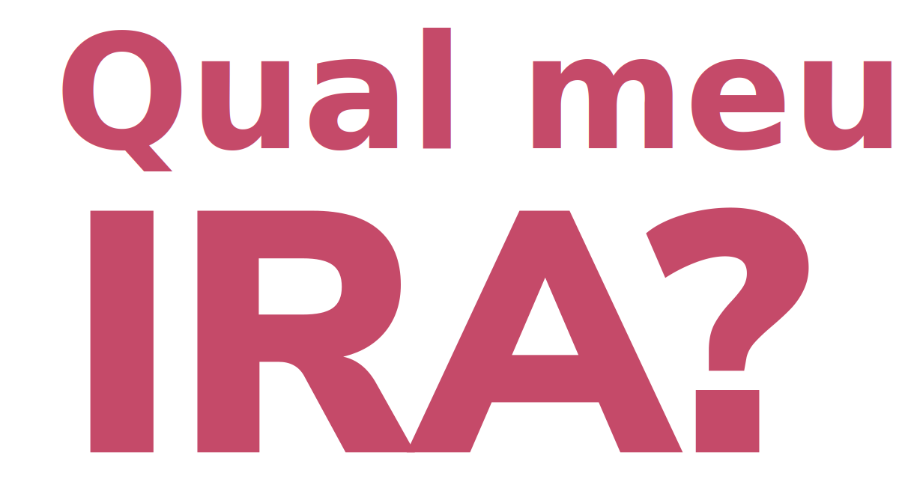
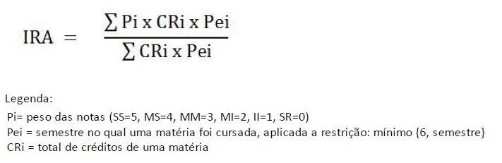

    
# Qual meu IRA? | UnB
Uma das métricas mais importantes do desempenho do estudante universitário é o IRA, Índice de Rendimento Acadêmico. Quanto mais alto o IRA, maior a oportunidade de matrícula, participação em projetos de pesquisa, eventos, entre outros. 
    
Apesar de importante, esse índice tem uma fórmula ligeiramente complicada e seu cálculo costuma ser feito apenas nas plataformas de gerência estudantil (SIGAA). Por isso, é difícil calcular esse índice antes do término do semestre ou estimar o mínimo desempenho necessário para alcançar um valor desejado.

Pensando nessa dificuldade e em formas de resolvê-la, desenvolvi essa aplicação que calcula o IRA com base nos dados históricos de aprovações do estudante.

    Esta aplicação não tem como objetivo fornecer documentos para comprovação acadêmica ou administrativa.

---

#### Essa aplicação foi toda desenvolvida em HTML, CSS e Javascript 

Fórmula para o cálculo do IRA:

Neste projeto, tentei implementar uma página com o mínimo de interações e mudanças de páginas possível para que o usuário não se sinta perdido e possa utilizar a ferramenta como uma fonte de consulta, não uma plataforma. Por isso, a opção para acessar conteúdos sobre o desenvolvedor ou entrar em contato foram feitas através de modais. 

As frameworks utilizadas foram Bootstrap e Mail.js, para design e recepção de emails dos usuários, respectivamente, permitindo melhor responsividade e personalização e reduzindo o caminho necessário para o contato.
