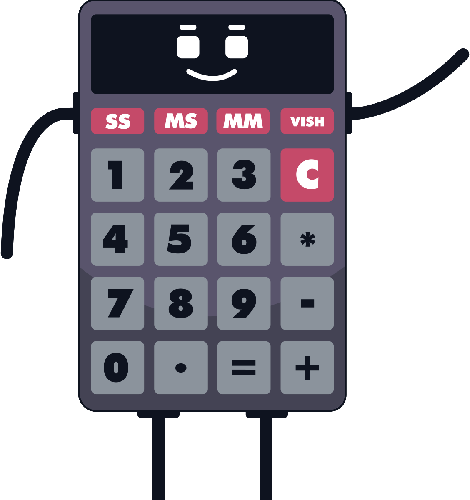

    

    

    
# Qual meu IRA? | UnB
Uma das métricas mais importantes do desempenho do estudante universitário é o IRA, Índice de Rendimento Acadêmico. Esse índice é útil para a auto-análise do discente, mas também serve como parâmetro de admissão em vários projetos no ambiente acadêmico.
    
Apesar de importante, esse índice tem uma fórmula um pouco complicada e seu cálculo costuma ser feito apenas nas plataformas de gerência estudantil, o que dificulta seu acesso ou previsões de alterações, de acordo com resultados ainda não publicados.

Pensando nisso, desenvolvi essa aplicação que calcula o IRA com base nos dados históricos de aprovações do estudante.

---

Esta aplicação não tem como objetivo fornecer documentos para comprovação acadêmica ou administrativa.
